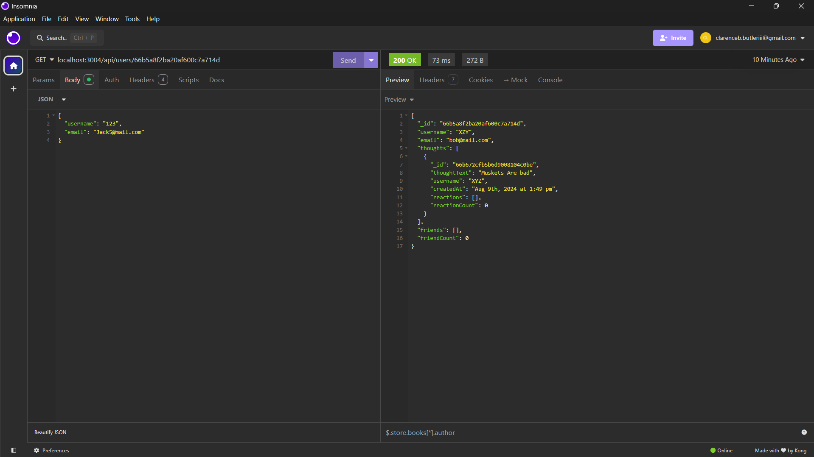
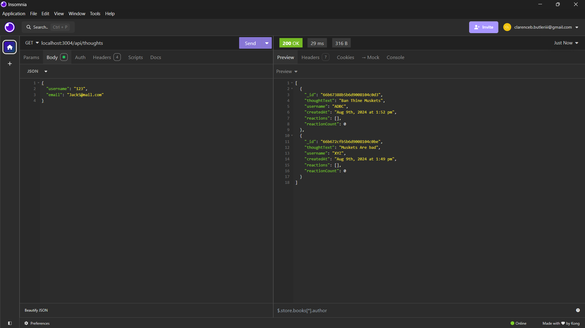

# Network-Socially

## Description
An API for users to share their thoughts, react to friends' thoughts, and create a friends list using NoSQL, Express, Mongoose, and Mongo
  
## Table of Contents
-[Installation](#installation)
-[Usage](#usage)
-[Contributing](#contributing)
-[Tests](#tests)
-[Questions](#questions)
-[License](#license)

## Installation
Clone the repository from the   
github page, open the file and in the terminal run `npm i` to make sure everything is up to date.    
Then run `npm start`, to boot up the backend functionality

## Usage
Use my project to help create a simple social platform by easily incorporatingmy work intot he backend, and leaving only frontend code to complete

## Contributing
Contributions are welcome, just create a new branch and add any functionality to the code that would compliment what is already implemented

## Tests
Create some test files and run the `npm run test` script in the terminal

## Questions
For any questions about the project, contact [cbbutler01](https://github.com/cbbutler01) or Email me at clarenceb.butleriii@gmail.com.

## License

Licensed under [MIT](https://opensource.org/licenses/MIT) license.
